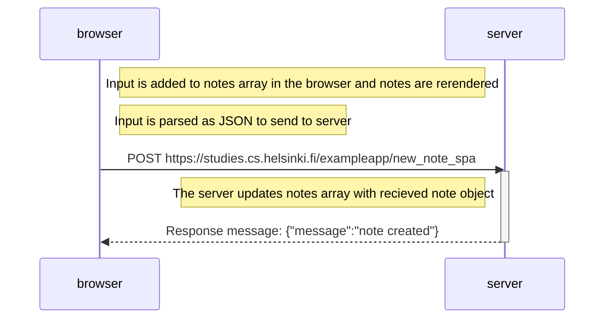

```mermaid
sequenceDiagram
    participant browser
    participant server

    Note right of browser: Input is added to notes array in the browser and notes are rerendered
    Note right of browser: Input is parsed as JSON to send to server
    browser->>server: POST https://studies.cs.helsinki.fi/exampleapp/new_note_spa
    activate server
    Note left of server: The server updates notes array with recieved note object
    server-->>browser: Response message: {"message":"note created"}
    deactivate server
```